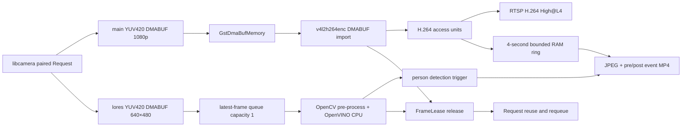

# EggVision

Raspberry Pi 4에서 libcamera 저수준 API로 카메라 요청 하나에 두 개의 YUV420 스트림을 만들고 다음 작업을 동시에 수행한다.

- main 1920×1080@30: libcamera DMABUF를 복사하지 않고 GStreamer V4L2 H.264 인코더로 전달하여 RTSP 송출
- lores 640×480@30: latest-frame 큐를 통해 OpenVINO YOLOv5n 320×320 사람 추론

기본 RTSP URL은 `rtsp://<raspberry-pi-ip>:8554/stream`이다. 현재 검증 장비는 Raspberry Pi 4B 8GB, Debian 12, kernel 6.12.45, OV5647이다.

## 데이터 흐름



`FrameLease`는 상시 H.264 인코더와 추론 소비자가 공유한다. 두 소비자가 참조를 모두 반환하기 전에는 libcamera 요청을 재사용하지 않는다. RTSP와 이벤트 녹화는 애플리케이션이 소유하는 압축 AU를 공유하므로 카메라 요청을 붙잡지 않는다. 감지 이벤트는 같은 paired Request의 main 프레임만 한 번 복사한 뒤 lease를 즉시 반환한다.

## 의존성 설치

Raspberry Pi OS/Debian Bookworm에서 다음 스크립트를 실행한다.

```bash
sudo ./scripts/install_dependencies.sh
```

이 프로젝트는 다음 개발 패키지를 사용한다.

- libcamera 0.5.x
- GStreamer 1.22: core, app, allocators, RTSP server, video, good/bad/ugly/libav plugins
- OpenVINO Runtime 2025.3 (`/usr/local/runtime`)
- OpenCV 4.9 (`/usr/local`)

`gstreamer1.0-libcamera`는 이 애플리케이션에 필요하지 않다. 배포판 패키지가 현재 동작 중인 커스텀 libcamera를 교체할 수 있으므로 설치 스크립트에서도 제외했다.

## 모델 준비

OpenVINO IR 두 파일을 다음 위치에 둔다.

```text
models/yolov5n.xml
models/yolov5n.bin
```

모델 입력은 FP32 `[1,3,320,320]`, 출력은 FP32 `[1,6300,85]`여야 한다. 모델 파일은 라이선스와 학습 데이터 provenance가 별도이므로 Git에서 제외한다. 자세한 내용은 `models/README.md`를 참고한다.

## 사전 점검

```bash
./scripts/preflight.sh
```

이 스크립트는 카메라 열거, 3초 캡처, GStreamer 요소, H.264 encoder DMABUF import 속성, OpenVINO/OpenCV CMake package, 모델 파일을 검사한다. 카메라 케이블을 전원이 켜진 상태에서 연결한 뒤 장치가 보이지 않는다면 먼저 재부팅한다.

```bash
sudo reboot
rpicam-hello --list-cameras
```

## 빌드와 테스트

```bash
cmake -S . -B build \
  -DCMAKE_BUILD_TYPE=Release \
  -DOpenVINO_DIR=/usr/local/runtime/cmake \
  -DOpenCV_DIR=/usr/local/lib/cmake/opencv4
cmake --build build -j2
ctest --test-dir build --output-on-failure
```

Debug 빌드는 `-DCMAKE_BUILD_TYPE=Debug`로 분리한다.

## 실행

```bash
export LD_LIBRARY_PATH=/usr/local/runtime/lib/aarch64:/usr/local/lib:${LD_LIBRARY_PATH:-}
./build/eggvision_app
```

주요 옵션:

```text
--model PATH
--port 8554
--mount /stream
--bitrate 4000000
--gop 15
--confidence 0.30
--nms 0.45
--inference-threads 2
--events-dir /var/lib/eggvision/events
--event-pre-seconds 1.5
--event-post-seconds 1.5
--event-cooldown-seconds 10
--event-ring-seconds 4
--event-ring-max-bytes 8388608
--event-min-free-bytes 1073741824
--event-jpeg-quality 90
--event-container mp4
--duration SECONDS
--no-inference
--no-event-recording
```

확정된 해상도, stride, plane FD/offset, 모델 shape를 시작할 때 출력한다. 5초마다 캡처·RTSP·추론 FPS, 드롭 수, outstanding lease, 오류 수를 JSON 한 줄로 출력한다. SIGINT와 SIGTERM은 카메라 생산 중지, RTSP 종료, 추론 종료 순서로 안전하게 정리한다.

## 사람 감지 이벤트 저장

사람이 감지되면 `/var/lib/eggvision/events/YYYY-MM-DD/<event-id>/` 아래에 다음 파일을 저장한다.

- `snapshot.jpg`: 감지에 사용한 lores 프레임과 동일한 paired Request의 1920×1080 main 프레임
- `clip.mp4`: 감지 sensor timestamp 전후 각각 1.5초를 포함하는 H.264 High@L4 영상. 앞쪽 경계 이전의 가장 가까운 IDR부터 시작하며 재인코딩하지 않는다.
- `metadata.json`: 요청·실제 영상 경계, detection 좌표, pre/post 완전성, artifact 상태와 오류

작업 중에는 숨김 `.partial` 디렉터리를 사용하고 finalize가 끝난 이벤트만 최종 이름으로 원자적으로 공개한다. 기본 10초 cooldown 동안의 반복 감지는 별도 이벤트로 만들지 않는다. 저장소의 가용 공간이 기본 1 GiB보다 적으면 새 이벤트만 거부하고 카메라·추론·RTSP는 계속 동작한다.

개발 빌드에서 실제 모델 검출과 무관하게 한 번 재현하려면 test hook을 켜고 실행한다.

```bash
cmake -S . -B build -DEGGVISION_ENABLE_TEST_HOOKS=ON
EGGVISION_EVENT_TEST_TRIGGER_AFTER_MS=2000 ./build/eggvision_app \
  --events-dir /tmp/eggvision-events --duration 8 --no-inference
```

## RTSP 확인

TCP 수신:

```bash
gst-launch-1.0 -v \
  rtspsrc location=rtsp://127.0.0.1:8554/stream protocols=tcp latency=100 \
  ! rtph264depay ! h264parse ! fakesink sync=false
```

UDP를 포함한 3회 재접속 자동 검증:

```bash
./scripts/verify_rtsp.sh rtsp://127.0.0.1:8554/stream 3 10
```

VLC나 ffplay에서도 같은 URL을 열 수 있다. SDP/수신 caps는 H.264 High Profile, Level 4, 1920×1080, 30 FPS여야 한다.

## Zero-copy 범위

main 경로에는 전체 프레임 `memcpy`, `videoconvert`, CPU color conversion이 없다.

1. libcamera가 내보낸 세 YUV420 plane은 동일 DMABUF FD의 서로 다른 offset이다.
2. 애플리케이션은 FD를 `dup()`하고 실제 `GstDmaBufAllocator`로 `GstMemory`를 만든다.
3. 하나의 DMABUF memory와 세 plane offset/stride를 `GstVideoMeta`에 기록한다.
4. `v4l2h264enc output-io-mode=dmabuf-import`가 이 FD를 하드웨어 인코더에 import한다.
5. GStreamer buffer 파괴 시 `FrameLease`가 해제된다.

Debian GStreamer 1.22의 `v4l2h264enc` pad template은 DMABUF import를 지원하면서도 caps에는 `memory:DMABuf` feature를 광고하지 않는다. 따라서 caps는 `video/x-raw`로 협상하고 실제 memory type과 `output-io-mode=dmabuf-import`로 zero-copy를 보장한다. feature를 강제로 붙이면 `not-linked`가 발생한다.

lores 추론 전처리에는 의도적으로 복사가 있다. stride가 있는 Y/U/V plane을 연속 I420으로 복사하고 BGR 변환, letterbox, RGB FP32 NCHW 변환을 수행한다. 이 복사는 640×480 추론 분기에만 존재하며 송출 경로와 무관하다.

OpenVINO CPU는 `LATENCY` 모드와 2개 inference thread를 기본으로 사용한다. 현재 Raspberry Pi/OpenVINO 조합에서 자동 스레드 설정은 반복 추론 시 RSS가 증가했지만, 2개로 고정하면 모델 단독 500회에서 RSS가 고정되고 약 10 FPS를 유지했다. 스레드 수를 변경하면 반드시 장시간 RSS와 온도를 다시 검증한다.

## 장시간 시험

빌드가 끝난 상태에서 다음 명령은 앱을 30분 실행하고 시작 시 RTSP 재접속 시험도 수행한다.

```bash
./scripts/soak_test.sh 1800
```

통과 조건은 마지막 로그의 `outstanding=0`, `capture_errors=0`, `rtsp_errors=0`, 캡처/송출 25 FPS 이상, 추론 8 FPS 이상이다. 시험 전후 `VmRSS`, `/proc/<pid>/fd` 개수와 kernel log도 스크립트가 기록한다.

## systemd 설치

모델과 Release 빌드를 준비한 뒤:

```bash
sudo cp deploy/eggvision.service /etc/systemd/system/
sudo systemctl daemon-reload
sudo systemctl enable --now eggvision
journalctl -u eggvision -f
```

서비스 파일은 저장소가 `/home/pi/eggvision`에 있다고 가정한다.

## 문제 해결

- `No cameras available`: 케이블 방향과 latch를 확인하고 재부팅한다. `rpicam-hello --list-cameras`에서 먼저 보여야 한다.
- `Failed enabling i/p port, ret -3`: H.264 caps가 High Profile/Level 4인지 확인한다. 1080p30에서 기본 협상된 Level 1은 펌웨어가 거부한다.
- `Got 3 dmabuf but needed 1`: 같은 FD의 세 plane을 각각 GstMemory로 추가한 구현이다. 현재 코드는 하나의 memory와 세 VideoMeta offset으로 결합한다.
- RTSP 503: `GST_DEBUG=v4l2*:6,rtspmedia:5`로 실행해 caps 고정 여부와 DMABUF import 오류를 확인한다.
- 모델 초기화 실패: XML과 BIN이 함께 있는지, shape가 `[1,3,320,320]`/`[1,6300,85]`인지 확인한다.
- 포트 재사용 실패: 이전 `eggvision_app` 프로세스가 남아 있는지 `ss -ltnp | grep 8554`로 확인한다.

## 범위 밖 기능

현재 단계에는 tracking, line crossing, 위험 분석, 영상 overlay, 별도 metadata 전송 채널을 포함하지 않는다. 추론 결과는 구조화 로그로만 출력한다.
